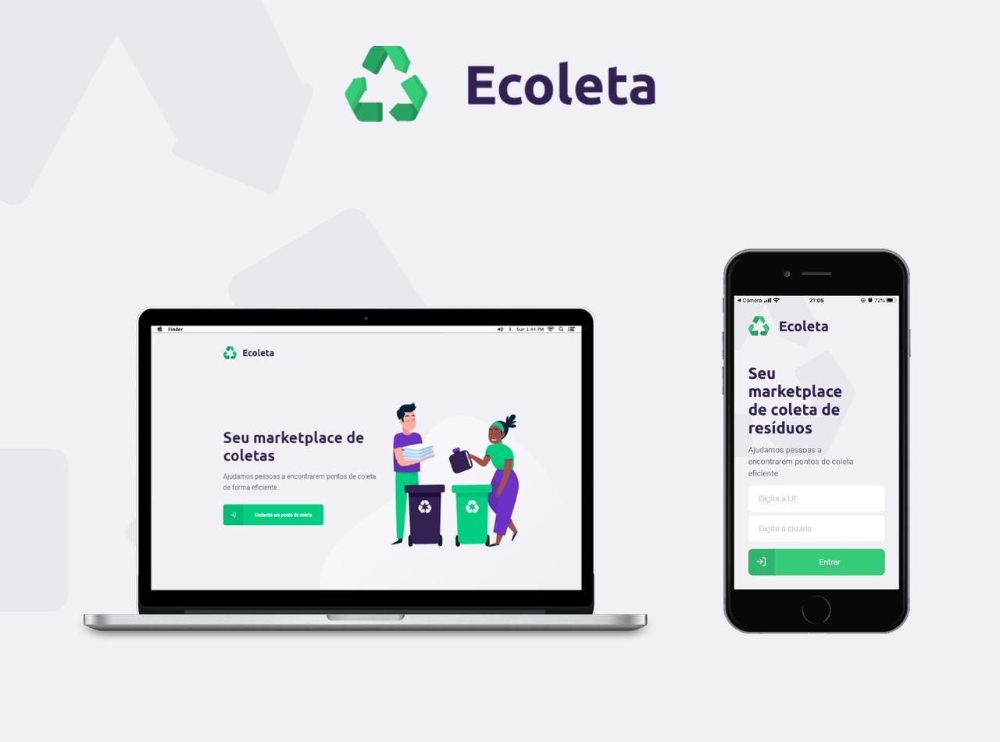

<h3 align="center">
    
    <br><br>
    <b>Ajude-nos a coletar!</b>  
    <br>
</h3>

# Índice

- [Sobre](#sobre)
- [Documentação](#documentacao)
- [Tecnologias Utilizadas](#tecnologias-utilizadas)
- [Como Usar](#como-usar)
- [Como Contribuir](#como-contribuir)

<a id="sobre"></a>

## :bookmark: Sobre

O <strong>Ecoleta</strong> é uma aplicação cujo objetivo é ajudar pessoas a encontrarem pontos de coleta para reciclagem de diversos materiais. Escolha a sua cidade/estado, cadastre um ponto de coleta ou pesquise pelos pontos mais próximos de você.

<a id="documentacao"></a>

## :books: Documentação

Para reforçar alguns conceitos e registrar comandos que são dificeis de se lembrar eu fiz uma pequena **[DOCUMENTAÇÃO](DOCUMENTATION.md)** para ajudar quem esta iniciando com **TypeScript**, **Node**, **ReactJS** e **React Native**.

<a id="tecnologias-utilizadas"></a>

## :rocket: Tecnologias Utilizadas

O projeto foi desenvolvido utilizando as seguintes tecnologias

- [TypeScript](https://www.typescriptlang.org/)
- [Node.js](https://nodejs.org/en/)
- [ReactJS](https://reactjs.org/)
- [React Native](https://reactnative.dev/)

## :heavy_check_mark: Resultado:



- O layout está disponível no **[Figma](https://www.figma.com/file/1SxgOMojOB2zYT0Mdk28lB/)**;

<h2> 🎥 <a hfre='https://www.youtube.com/watch?v=Vy96B0IjAso' target='_parent'> Vídeo de Demonstração</a></h2>

<a id="como-usar"></a>

## :fire: Como usar

- ### **Pré-requisitos**

  - É **necessário** possuir o **[Node.js](https://nodejs.org/en/)** instalado na máquina
  - Também, é **preciso** ter um gerenciador de pacotes seja o **[NPM](https://www.npmjs.com/)** ou **[Yarn](https://yarnpkg.com/)**.
  - Por fim, é **essencial** ter o **[Expo](https://expo.io/)** instalado de forma global na máquina

1. Faça um clone :

```sh
  $ git clone https://github.com/vitorserrano/ecoleta.git
```

2. Executando a Aplicação:

```sh
  # Instale as dependências
  $ npm install

  ## Crie o banco de dados
  $ cd server
  $ npm run knex:migrate
  $ npm run knex:seed

  # Inicie a API
  $ npm run dev

  # Inicie a aplicação web
  $ cd web
  $ npm start

  # Inicie a aplicação mobile
  $ cd mobile
  $ npm start
```

<a id="como-contribuir"></a>

## :recycle: Como contribuir

- Faça um Fork desse repositório,
- Crie uma branch com a sua feature: `git checkout -b my-feature`
- Commit suas mudanças: `git commit -m 'feat: My new feature'`
- Push a sua branch: `git push origin my-feature`

## :memo: License

Esse projeto está sob a licença MIT. Veja o arquivo [LICENSE](LICENSE.md) para mais detalhes.
